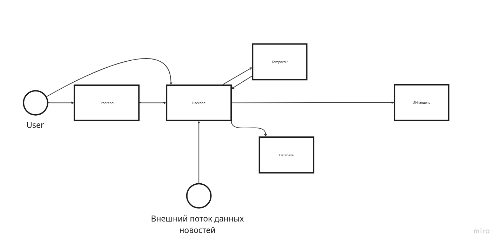
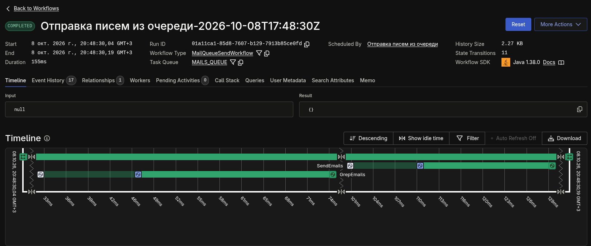

# Основная архитектура приложения

### Основные тезисы
Наше приложение должно содержать внешнюю пользовательскую сторону, которой будет пользоваться представители кампании для настройки своего бизнеса в системе. Бэкенд должен реализовывать ручки, которые позволяют работать с системой при помощи фронта, а так же реализовывать потоки данных для анализа новостных статей. Бэкенд должен иметь интеграции с внешним потоком данных, а так же с ИИ

*Рис. 1 - Диаграмма архитектуры приложения*

### Фронтенд
Современный формат индустрии - это SSR (server side rendering) SPA (single page application) приложения. То есть фактически одностраниченые приложения, контент на которых генерируется на сервере. 

Для скорости разработки будем использовать фреймворк Next.js с библеотекой React. Он реализует  небходимые нам SSR и SPA, а так же много полезных фич, по типу lazy loading компонентов

Фронтенд будет тонкий, то есть фактической прослойкой к бэкенду. Общаемся с бэком по внутренней сети для сервеного рендеринга и по внешней для пользовательских запросов (но постараюсь их избежать). На бэк в общем случае ходим по REST HTTP, для ии агента будет контракт для web socket. 

### Бэкенд
Бэкенд - это монолит Spring Boot приложение
Подробная проработка архитектуры бека будет позже

Нужно реализовать реактивное неблокирующее приложение. Для этого будем использовать встроенный project reactor. В бд ходим при помощи реактивного драйвера r2dbc.

### Temporal
Фактически наша доменная модель представляет собою 3 независимый потока работы (далее workflow). Для их целостности и инкапсуляции будем использовать temporal. Это технология разбиение работы сервисов на потоке данных и удобное отслеживание процесса их выполнения.

*Рис. 2 - Пример как выглядит флоу*

По сути - это просто визуальная обертка, использование которой гарантирует независимость потоков исполнения workflow

Весь код все равно выполняется внутри нашего бэкенда

### База данных
Я думаю, тут не надо мудрить, и возьмем просто постгрес.
Основная сложность - хранить граф. Мы его можем хранить в виде плоского массива данных, добавив индексы по id и parentId мы гарантируем извлечение любого узла за ***O(1)***.

Проработка структуры бд будет позже.

### ИИ составляющая бэкенда
С фронтом общаемся при помощи клиентской webSocket сессии. С бд скорее всего будем общаться при помощи streaming http. Но подробный контракт будет известен, когда поймем, как мы ходим к ИИ.

Для чата будем использовать spring AI - технология, которая позволяет из коробки реализовать сессии с ИИ
 
Системные промпты будем хранить в виде txt файлов в resource директории. Они будут перечислены в конфиге

